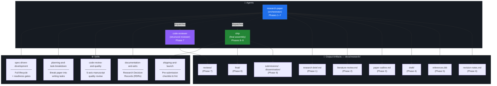
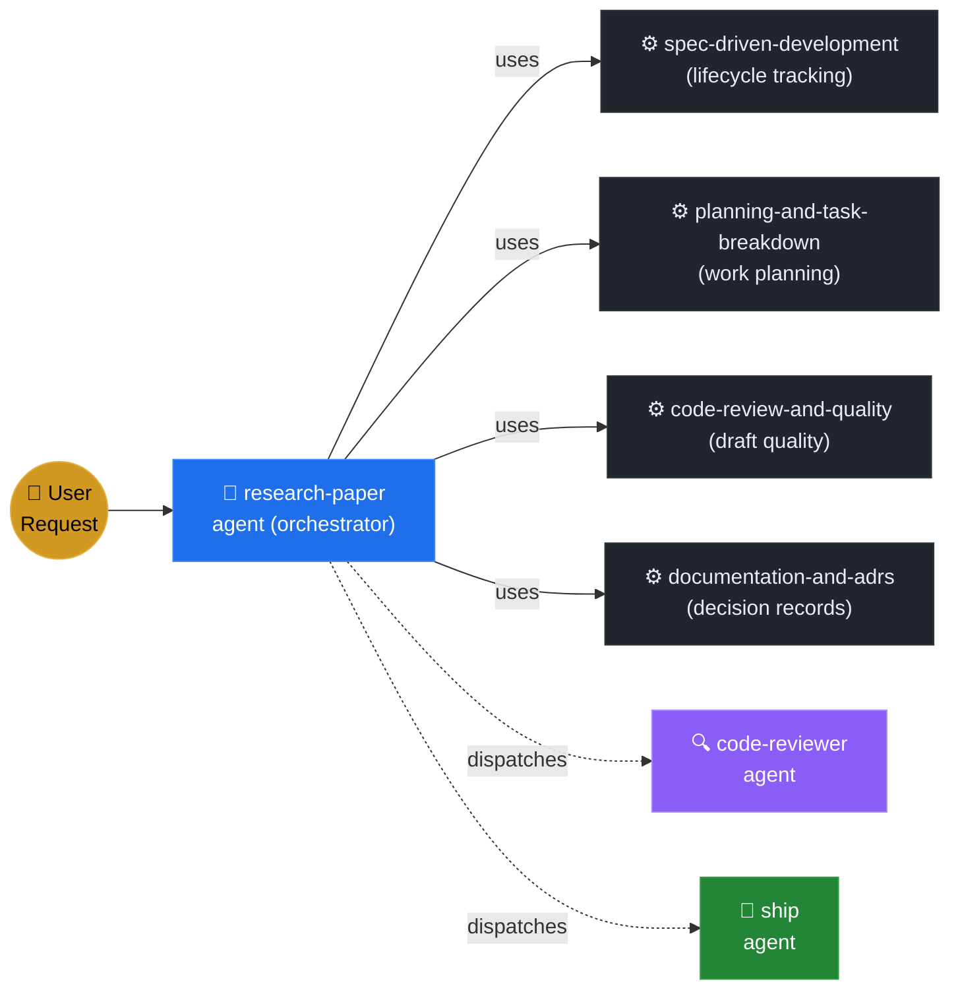

# 🎓 Research Buddy

> **AI-powered research paper writing assistant** — guides you through the
> complete academic paper lifecycle, from the first spark of an idea to a
> published, citable paper.

Research Buddy is a collection of **GitHub Copilot agents and skills** that
orchestrate the full 9-phase research paper workflow. It tracks your progress,
enforces quality gates at every phase transition, and always tells you exactly
where you are and what to do next.

---

## ✨ Features

- 🧭 **Always-on readiness tracking** — know your exact phase and what's blocking you
- 📝 **9-phase lifecycle** — covers ideation through publication and dissemination
- 🚦 **Readiness gates** — explicit criteria that must pass before advancing
- 📚 **Literature review** — systematic search, analysis, and synthesis
- ✍️ **Academic writing guidance** — section-by-section drafting with style enforcement
- 📎 **Citation management** — BibTeX generation, verification, and formatting
- 🔍 **Peer review simulation** — three simulated reviewers catch weaknesses early
- 📦 **Venue formatting** — ACM, IEEE, NeurIPS, Springer, arXiv templates
- 📢 **Post-submission support** — rebuttal prep, camera-ready, dissemination

---

## 📋 Table of Contents

- [The 9-Phase Lifecycle](#-the-9-phase-lifecycle)
- [Architecture](#-architecture)
- [Quick Start](#-quick-start)
- [Usage Guide](#-usage-guide)
- [Readiness Dashboard](#-readiness-dashboard)
- [Commands Reference](#-commands-reference)
- [Output Directory Structure](#-output-directory-structure)
- [Agents & Skills](#-agents--skills)
- [Repository Structure](#-repository-structure)
- [Key Principles](#-key-principles)
- [Contributing](#-contributing)

---

## 🔄 The 9-Phase Lifecycle

Research Buddy guides you through **9 phases** from idea to publication. Each
phase has a **readiness gate** — a set of criteria that must be met before you
can advance.

```mermaid
graph LR
    P1["💡 Phase 1\nIdea & Scope"]
    P2["📚 Phase 2\nLiterature Review"]
    P3["📐 Phase 3\nOutline & Structure"]
    P4["✍️ Phase 4\nSection Drafting"]
    P5["📎 Phase 5\nCitation Management"]
    P6[" Phase 6\nRevision & Polishing"]
    P7["🔍 Phase 7\nPeer Review Simulation"]
    P8["📦 Phase 8\nFinal Assembly"]
    P9["📢 Phase 9\nPost-Submission"]

    P1 -->|"🚦 Gate"| P2 -->|"🚦 Gate"| P3 -->|"🚦 Gate"| P4 -->|"🚦 Gate"| P5
    P5 -->|"🚦 Gate"| P6 -->|"🚦 Gate"| P7 -->|"🚦 Gate"| P8 -->|"🚦 Gate"| P9

    style P1 fill:#1f6feb,color:#fff,stroke:#388bfd
    style P2 fill:#1f6feb,color:#fff,stroke:#388bfd
    style P3 fill:#1f6feb,color:#fff,stroke:#388bfd
    style P4 fill:#1f6feb,color:#fff,stroke:#388bfd
    style P5 fill:#1f6feb,color:#fff,stroke:#388bfd
    style P6 fill:#8b5cf6,color:#fff,stroke:#a78bfa
    style P7 fill:#8b5cf6,color:#fff,stroke:#a78bfa
    style P8 fill:#8b5cf6,color:#fff,stroke:#a78bfa
    style P9 fill:#238636,color:#fff,stroke:#2ea043
```



> 🚦 **Readiness Gates** between every phase — explicit criteria must pass before advancing.

### Phase Summary

| # | Phase | Goal | Key Output | Gate Criteria (summary) |
|---|-------|------|------------|------------------------|
| 1 | 💡 **Idea & Scope** | Define a clear, novel research question | `research-brief.md` | RQ defined, contributions listed, scope bounded, venue chosen |
| 2 | 📚 **Literature Review** | Comprehensive, synthesized review of related work | `literature-review.md` | ≥15 papers analyzed, comparison table, gaps identified |
| 3 | 📐 **Outline & Structure** | Detailed skeleton for the entire paper | `paper-outline.md` | All sections outlined, argument flow mapped |
| 4 | ✍️ **Section Drafting** | Draft every section with evidence and citations | `draft/*.md` | All 7 sections drafted, claims cited or flagged |
| 5 | 📎 **Citation Management** | Accurate, complete, properly formatted citations | `references.bib` | No `[CITATION NEEDED]`, all refs verified, no orphans |
| 6 | 🔄 **Revision & Polishing** | Elevate from "complete" to "submission-quality" | `revision-notes.md` | 3 revision passes done, all critical issues fixed |
| 7 | 🔍 **Peer Review Simulation** | Anticipate and address reviewer concerns | `reviews/*.md` | 3 reviews generated, avg ≥ Weak Accept, concerns addressed |
| 8 | 📦 **Final Assembly** | Submission-ready manuscript for target venue | `final/paper.md` | Page limit met, checklist passed, anonymized if needed |
| 9 | 📢 **Post-Submission** | Submission through publication and dissemination | `submissions/`, `rebuttal/`, `dissemination/` | Submitted, rebuttal ready, preprint posted, slides created |

---

## 🏗 Architecture



---

## 🚀 Quick Start

### Prerequisites

- [GitHub Copilot](https://github.com/features/copilot) with agent mode enabled
- VS Code with the GitHub Copilot extension

### Getting Started

1. **Clone the repository:**
   ```bash
   git clone https://github.com/shashankswe2020-ux/research-buddy.git
   cd research-buddy
   ```

2. **Open in VS Code:**
   ```bash
   code .
   ```

3. **Start a new paper** — open Copilot Chat and use the research-paper agent:
   ```
   @research-paper start
   ```
   or describe your topic:
   ```
   @research-paper I want to write a paper on attention mechanisms for multi-scale feature fusion in medical image segmentation
   ```

4. **Check status at any time:**
   ```
   @research-paper status
   ```

---

## 📖 Usage Guide

### Starting a New Paper (Phase 1)

```
@research-paper start
```

The agent will:
1. Ask about your research area, interests, and initial ideas
2. Conduct a gap analysis
3. Help formulate a SMART research question
4. Define scope boundaries and contributions
5. Save a research brief to `docs/research/research-brief.md`
6. Report Phase 1 readiness status

### Conducting a Literature Review (Phase 2)

```
@research-paper literature review on <your topic>
```

The agent will:
1. Define a systematic search strategy
2. Find and analyze ≥15 relevant papers
3. Build a comparison table of approaches
4. Identify research gaps
5. Save to `docs/research/literature-review.md`
6. Report Phase 2 readiness status

### Creating an Outline (Phase 3)

```
@research-paper outline for <your topic>
```

The agent will:
1. Select the appropriate paper type and structure
2. Propose candidate titles
3. Outline every section at paragraph level
4. Map the argument flow
5. Save to `docs/research/paper-outline.md`

### Drafting Sections (Phase 4)

Draft individual sections or the whole paper:

```
@research-paper draft methodology
@research-paper draft introduction
@research-paper draft all sections
```

Each section is saved as a separate file in `docs/research/draft/`.

### Managing Citations (Phase 5)

```
@research-paper manage citations
@research-paper format references for IEEE
```

### Revising the Draft (Phase 6)

```
@research-paper revise
@research-paper polish my paper
```

Runs three revision passes: structure, writing quality, and technical accuracy.

### Simulating Peer Review (Phase 7)

```
@research-paper simulate peer review
@research-paper review my paper
```

Generates feedback from three simulated reviewers:
- **Reviewer 1:** Domain Expert
- **Reviewer 2:** Methodologist
- **Reviewer 3:** Skeptic

### Formatting & Shipping (Phase 8)

```
@ship format paper for NeurIPS
@ship run pre-submission checklist
@ship compile final manuscript
```

### Post-Submission (Phase 9)

```
@research-paper prepare rebuttal
@research-paper create presentation slides
@research-paper write blog post summary
```

---

## 📊 Readiness Dashboard

The agent always reports a readiness dashboard showing your progress. You can
request it at any time:

```
@research-paper status
```

### Example Dashboard Output

```
📊 RESEARCH PAPER STATUS — "Attention-Based Multi-Scale Feature Fusion"
═══════════════════════════════════════════════════════════════════════════

  Phase 1: Idea & Scope           ✅  Complete
  Phase 2: Literature Review      ✅  Complete (22 papers analyzed)
  Phase 3: Outline & Structure    ✅  Complete (IMRaD structure)
  Phase 4: Section Drafting       🔄  In Progress (5/7 sections drafted)
      → Missing: discussion.md, conclusion.md
  Phase 5: Citation Management    ⚠️  Needs Attention (3 [CITATION NEEDED] markers)
  Phase 6: Revision & Polishing   🚫  Blocked by Phase 4
  Phase 7: Peer Review Simulation 🚫  Blocked by Phase 6
  Phase 8: Final Assembly         🚫  Blocked by Phase 7
  Phase 9: Post-Submission        🚫  Blocked by Phase 8

  ───────────────────────────────────────────────
  Current Phase:   4 (Section Drafting)
  Blocking Items:  Draft discussion.md and conclusion.md
                   Resolve 3 [CITATION NEEDED] markers
  Next Milestone:  Complete all drafts → Phase 5 (Citation Management)
  ───────────────────────────────────────────────
```

### Status Icons

| Icon | Meaning |
|------|---------|
| ✅ | **Complete** — all readiness criteria met |
| 🔄 | **In Progress** — some criteria met, work ongoing |
| ⬜ | **Not Started** — no artifacts for this phase |
| 🚫 | **Blocked** — waiting on a prior phase |
| ⚠️ | **Needs Attention** — issues found that must be resolved |

---

## ⌨️ Commands Reference

### Research Paper Agent (`@research-paper`)

| Command | Phase | What It Does |
|---------|-------|-------------|
| `start` / `new paper` | 1 | Begin topic exploration and scope definition |
| `literature review on <topic>` | 2 | Conduct systematic literature review |
| `outline for <topic>` | 3 | Create detailed paper outline |
| `draft <section>` | 4 | Draft a specific section |
| `draft all sections` | 4 | Draft all remaining sections |
| `manage citations` / `format references` | 5 | Citation verification and formatting |
| `revise` / `polish my paper` | 6 | Three-pass revision (structure, writing, technical) |
| `simulate peer review` / `review my paper` | 7 | Generate 3 simulated reviews |
| `prepare rebuttal` | 9b | Write point-by-point response to reviews |
| `create presentation slides` | 9d | Generate conference talk slides |
| `write blog post summary` | 9d | Create accessible summary for broader audience |

### Ship Agent (`@ship`)

| Command | What It Does |
|---------|-------------|
| `format paper for <venue>` | Apply venue-specific formatting |
| `compile final manuscript` | Assemble all sections into one document |
| `run pre-submission checklist` | Verify completeness and compliance |
| `package for arXiv submission` | Prepare arXiv-ready package |

### Status Commands

| Command | What It Does |
|---------|-------------|
| `status` / `where am I?` | Show full readiness dashboard |
| `check phase N readiness` | Evaluate specific phase gate |
| `what's blocking me?` | List all blocking items |
| `what should I work on next?` | Recommend highest-priority action |

---

## 📂 Output Directory Structure

All research artifacts are saved under `docs/research/`:

```
docs/research/
│
├── research-brief.md                 # Phase 1: Research question & scope
├── literature-review.md              # Phase 2: Organized literature review
├── paper-outline.md                  # Phase 3: Detailed section outline
│
├── draft/                            # Phase 4: Individual section drafts
│   ├── abstract.md
│   ├── introduction.md
│   ├── related-work.md
│   ├── methodology.md
│   ├── experiments.md
│   ├── discussion.md
│   └── conclusion.md
│
├── references.bib                    # Phase 5: BibTeX references
├── references.md                     # Phase 5: Human-readable reference list
│
├── revision-notes.md                 # Phase 6: Revision checklist & notes
│
├── reviews/                          # Phase 7: Simulated peer reviews
│   ├── reviewer-1-domain-expert.md
│   ├── reviewer-2-methodologist.md
│   ├── reviewer-3-skeptic.md
│   └── review-response-plan.md
│
├── final/                            # Phase 8: Submission-ready output
│   ├── paper.md                      #   Full assembled paper (Markdown)
│   ├── paper.tex                     #   LaTeX version (if requested)
│   ├── references.bib                #   Finalized BibTeX
│   ├── figures/                      #   All figures
│   └── supplementary/                #   Appendices & extra material
│
├── submissions/                      # Phase 9a: Submission records
│   └── submission-log.md
│
├── rebuttal/                         # Phase 9b: Reviewer responses
│   ├── reviewer-responses.md
│   └── revision-changelog.md
│
├── camera-ready/                     # Phase 9c: Final published version
│   ├── paper-final.pdf
│   └── paper-final.tex
│
├── dissemination/                    # Phase 9d: Outreach materials
│   ├── slides.md
│   ├── blog-post.md
│   ├── social-media-drafts.md
│   └── poster.md
│
└── decisions/                        # Research Decision Records
    ├── rdr-001.md
    └── rdr-002.md
```

---

## 🤖 Agents & Skills

### Agents

| Agent | File | Role |
|-------|------|------|
| **research-paper** | `.github/agents/research-paper.agent.md` | Primary orchestrator — guides through Phases 1–7, 9 |
| **code-reviewer** | `.github/agents/code-reviewer.agent.md` | Structural manuscript reviewer — 5-axis quality evaluation |
| **ship** | `.github/agents/ship.agent.md` | Final assembly & venue formatting — Phases 8–9 |

### Skills

| Skill | Directory | Purpose |
|-------|-----------|---------|
| **spec-driven-development** | `.github/skills/spec-driven-development/` | Complete lifecycle definition with readiness gates |
| **planning-and-task-breakdown** | `.github/skills/planning-and-task-breakdown/` | Break paper into ordered, verifiable writing tasks |
| **code-review-and-quality** | `.github/skills/code-review-and-quality/` | 5-axis manuscript review (argumentation, clarity, evidence, structure, style) |
| **documentation-and-adrs** | `.github/skills/documentation-and-adrs/` | Research Decision Records (RDRs) for methodology choices |
| **shipping-and-launch** | `.github/skills/shipping-and-launch/` | Pre-submission checklist, venue formatting, packaging |

### How Agents and Skills Connect



---

## 📁 Repository Structure

```
research-buddy/
├── .github/
│   ├── copilot-instructions.md          # Global Copilot instructions
│   ├── agents/
│   │   ├── research-paper.agent.md      # Primary research paper agent
│   │   ├── code-reviewer.agent.md       # Structural review agent
│   │   └── ship.agent.md                # Shipping & formatting agent
│   └── skills/
│       ├── spec-driven-development/     # Lifecycle + readiness gates
│       ├── planning-and-task-breakdown/ # Writing task decomposition
│       ├── code-review-and-quality/     # Manuscript quality review
│       ├── documentation-and-adrs/      # Research Decision Records
│       └── shipping-and-launch/         # Pre-submission & packaging
├── docs/
│   ├── templates/                       # Reusable templates
│   └── research/                        # Generated research artifacts
├── LICENSE
└── README.md                            # This file
```

---

## 🎯 Key Principles

1. **Academic integrity is non-negotiable.** Never fabricate citations, data, or results.
2. **Accuracy over speed.** Better to leave a placeholder than generate incorrect information.
3. **Always know where you are.** The agent reports readiness status at every interaction.
4. **Structured output.** All artifacts follow the `docs/research/` directory convention.
5. **Citation-backed claims.** Every factual assertion must have a verifiable reference.
6. **Venue-aware formatting.** Always consider the target venue's style guide.
7. **No phase skipping.** Readiness gates exist for a reason — respect them.
8. **Iterate, don't perfect.** Complete each phase, then refine in later phases.

---

## 🤝 Contributing

This project is a set of Copilot agent definitions and skill files. To contribute:

1. **Fork** this repository
2. **Create a branch** for your changes
3. **Edit** the relevant `.agent.md` or `SKILL.md` files
4. **Test** by using the agents in VS Code with Copilot
5. **Submit a PR** describing what you changed and why

### Areas for Contribution

- 🆕 New skills (e.g., `experiment-design`, `figure-creation`, `grant-writing`)
- 📝 Improved prompts and instructions in existing agents/skills
- 📄 Templates for common paper types or venues
- 🐛 Bug fixes in readiness gate criteria
- 📚 Documentation improvements

---

## 📄 License

See [LICENSE](LICENSE) for details.

---

## 🧪 Demo: Complete 9-Phase Walkthrough

We ran Research Buddy through all 9 phases with a demo paper:
**"AdaptRAG: Adaptive Retrieval-Augmented Generation for Reducing Hallucinations in Large Language Models"**

> ⚠️ **Disclaimer:** This is a demonstration of the workflow. The paper, experimental
> results, and reviews are illustrative examples generated by the agent to showcase
> the 9-phase lifecycle. They are not actual experimental results.

### Final Readiness Dashboard

```
📊 RESEARCH PAPER STATUS — "AdaptRAG: Adaptive RAG for Reducing Hallucinations"
═════════════════════════════════════════════════════════════════════════════════

  Phase 1: Idea & Scope           ✅  Complete   → docs/research/research-brief.md
  Phase 2: Literature Review      ✅  Complete   → docs/research/literature-review.md (20 papers)
  Phase 3: Outline & Structure    ✅  Complete   → docs/research/paper-outline.md (IMRaD)
  Phase 4: Section Drafting       ✅  Complete   → docs/research/draft/ (7 sections)
  Phase 5: Citation Management    ✅  Complete   → docs/research/references.bib (20 entries)
  Phase 6: Revision & Polishing   ✅  Complete   → docs/research/revision-notes.md (3 passes)
  Phase 7: Peer Review Simulation ✅  Complete   → docs/research/reviews/ (3 reviews + response plan)
  Phase 8: Final Assembly         ✅  Complete   → docs/research/final/paper.tex (LaTeX + Markdown)
  Phase 9: Post-Submission        ✅  Complete   → docs/research/submissions/ + dissemination/

  Status: ALL 9 PHASES COMPLETE ✅
```

### Demo Paper Summary

```mermaid
graph TB
    subgraph RQ["🔬 Research Question"]
        Q["How can adaptive RAG pipelines dynamically adjust\nretrieval depth and source selection to\nminimize hallucinations in LLMs?"]
    end

    subgraph CONTRIB["🎯 Key Contributions"]
        C1["1. AdaptRAG framework\nwith 3-tier adaptive retrieval"]
        C2["2. Query complexity classifier\n87% accuracy · 30ms overhead"]
        C3["3. 12-18% hallucination reduction\non 3 benchmarks"]
        C4["4. Ablation study\nadaptive depth = #1 component"]
    end

    subgraph RESULTS["📊 Main Results (LLaMA-3-8B)"]
        R1["TruthfulQA\nSelf-RAG: 48.3\nAdaptRAG: 54.6 (+6.3)"]
        R2["HaluEval\nSelf-RAG: 73.2\nAdaptRAG: 79.8 (+6.6)"]
        R3["FActScore\nSelf-RAG: 71.8\nAdaptRAG: 78.4 (+6.6)"]
    end

    subgraph REVIEW["🔍 Peer Review Scores"]
        V1["🧠 Domain Expert\n7/10 · Weak Accept"]
        V2["📐 Methodologist\n6/10 · Borderline"]
        V3["🤔 Skeptic\n5/10 · Weak Reject"]
    end

    RQ --> CONTRIB --> RESULTS --> REVIEW

    style RQ fill:#161b22,stroke:#388bfd,color:#e6edf3
    style CONTRIB fill:#161b22,stroke:#238636,color:#e6edf3
    style RESULTS fill:#161b22,stroke:#d29922,color:#e6edf3
    style REVIEW fill:#161b22,stroke:#8b5cf6,color:#e6edf3
    style Q fill:#0d1117,color:#e6edf3,stroke:#30363d
    style C1 fill:#0d1117,color:#e6edf3,stroke:#30363d
    style C2 fill:#0d1117,color:#e6edf3,stroke:#30363d
    style C3 fill:#0d1117,color:#e6edf3,stroke:#30363d
    style C4 fill:#0d1117,color:#e6edf3,stroke:#30363d
    style R1 fill:#0d1117,color:#3fb950,stroke:#30363d
    style R2 fill:#0d1117,color:#3fb950,stroke:#30363d
    style R3 fill:#0d1117,color:#3fb950,stroke:#30363d
    style V1 fill:#238636,color:#fff,stroke:#2ea043
    style V2 fill:#d29922,color:#000,stroke:#e3b341
    style V3 fill:#f85149,color:#fff,stroke:#ff7b72
```



**Per-Complexity Gains:** Simple +3.7 · Intermediate +7.1 · Complex +9.7 · **Target Venue:** ACL 2026 (8-page long paper)

### Generated Artifacts

All demo artifacts are in [`docs/research/`](docs/research/):

```
docs/research/
├── research-brief.md                  ← Phase 1: RQ, contributions, scope, venue
├── literature-review.md               ← Phase 2: 20 papers, 4 themes, comparison table
├── paper-outline.md                   ← Phase 3: IMRaD structure, argument flow map
├── draft/                             ← Phase 4: All 7 sections
│   ├── abstract.md                       (250 words)
│   ├── introduction.md                   (1.5 pages, 4 contributions)
│   ├── related-work.md                   (2 pages, 4 subsections)
│   ├── methodology.md                    (3 pages, architecture + 3 components)
│   ├── experiments.md                    (2.5 pages, 4 tables + analysis)
│   ├── discussion.md                     (1 page, interpretation + threats)
│   └── conclusion.md                     (0.5 pages, 3 future directions)
├── references.bib                     ← Phase 5: 20 BibTeX entries, all verified
├── references.md                      ← Phase 5: Human-readable reference list
├── revision-notes.md                  ← Phase 6: 3 passes, 5 issues resolved
├── reviews/                           ← Phase 7: Simulated peer review
│   ├── reviewer-1-domain-expert.md       (Weak Accept — missing baseline, error analysis)
│   ├── reviewer-2-methodologist.md       (Borderline — stats, fairness, synthetic labels)
│   ├── reviewer-3-skeptic.md             (Weak Accept — novelty, real-world eval, ethics)
│   └── review-response-plan.md           (4 critical + 6 important + 4 suggestions)
├── final/                             ← Phase 8: Submission-ready
│   ├── paper.md                          (Full assembled paper)
│   ├── paper.tex                         (LaTeX with tables, citations, ACL format)
│   └── references.bib                    (Finalized BibTeX)
├── submissions/                       ← Phase 9a: Submission log
│   └── submission-log.md
├── dissemination/                     ← Phase 9d: Slides, blog, social media
│   └── slides.md
└── decisions/                         ← Research Decision Records
    └── rdr-001.md                        (Classifier approach selection)
```

### 📊 Researcher Dashboard (UI)

A **visual, interactive HTML dashboard** gives you a complete birds-eye view of your research project:

🌐 **[`docs/research/dashboard.html`](docs/research/dashboard.html)** — open in any browser
📄 **[`docs/research/DASHBOARD.md`](docs/research/DASHBOARD.md)** — Markdown fallback for GitHub

#### Opening the Dashboard

**Option 1 — VS Code Simple Browser** (recommended):
```bash
# Right-click dashboard.html → "Open with Live Server" or use:
# Cmd+Shift+P → "Simple Browser: Show" → paste file path
```

**Option 2 — System browser:**
```bash
open docs/research/dashboard.html        # macOS
xdg-open docs/research/dashboard.html    # Linux
start docs/research/dashboard.html       # Windows
```

**Option 3 — Live Server** (auto-refresh on changes):
```bash
npx live-server docs/research --open=/dashboard.html
```

#### What the Dashboard Shows

| Panel | Description |
|-------|-------------|
| **📈 Stats Row** | At-a-glance metrics — phases, citations, sections, review scores, word count |
| **🧭 Phase Progress** | Interactive timeline with progress bar, output links, gate status |
| **📝 Drafted Sections** | Table of all 7 paper sections with word counts and completion status |
| **🔍 Peer Review** | Score circles for each reviewer with recommendations and key concerns |
| **📚 Citation Library** | Searchable/filterable table of all 20 references with category tags and bar chart |
| **📦 Submission Timeline** | Visual timeline from submission → review → notification → camera-ready → conference |
| **🗂️ Artifact Map** | Clickable file tree of all 23 generated artifacts |

#### Features

- 🌙 **Dark theme** — designed for extended research sessions
- 🔍 **Citation search** — type to instantly filter the reference table
- � **Collapsible panels** — click any section header to expand/collapse
- 📱 **Responsive** — works on desktop and tablet
- 🔗 **Linked artifacts** — every file in the dashboard links to the actual artifact

> **Tip:** Run `@research-paper status` to regenerate the dashboard with the latest project state.

---

### Demo LaTeX Paper (Preview)

The complete LaTeX source is at [`docs/research/final/paper.tex`](docs/research/final/paper.tex).
It includes:

- ACL-formatted document with `\documentclass[11pt]{article}`
- Structured abstract (250 words)
- 6 sections following IMRaD structure
- 3 results tables (main results, ablation, per-complexity)
- 20 BibTeX references via `\bibliography{references}`
- Proper `\cite{}` commands throughout

To compile:
```bash
cd docs/research/final
pdflatex paper.tex
bibtex paper
pdflatex paper.tex
pdflatex paper.tex
```
